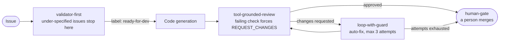

# agent-patterns

**15 patterns for multi-agent systems — each with a diagram, trade-offs, failure modes, when *not* to use it, and a runnable `impl.mjs`.**

Not a framework. Every pattern here was named after the problem it solved in a pipeline that runs: 12 of 15 are used in two public repos, [`autonomous-dev-loop`](https://github.com/koydas/autonomous-dev-loop) (GitHub Actions, headless) and [`ai-dev-tools`](https://github.com/koydas/ai-dev-tools) (Claude Code, interactive), and every row names where. The other 3 are marked as reference implementations. 9 patterns also have a **Where it came from** section linking the incident or ADR that forced them — for example, `loop-with-guard` exists because an auto-fix agent replaced a 26-test suite with an 18-line stub.

Try one without an API key: `node --test patterns/tool-grounded-review/impl.test.mjs` (11 tests), or see [Run one](#run-one).

How four of them compose in `autonomous-dev-loop`:



Labels carry the state between those workflows: that's [label-driven-state-machine](./patterns/label-driven-state-machine/).

## Find a pattern by the problem you have

### Flow control

| Your problem | Pattern | Running in |
|---|---|---|
| Agents hand each other prose instead of contracts; a failure mid-chain goes unnoticed | [sequential-pipeline](./patterns/sequential-pipeline/) | [`ai-dev-tools`](https://github.com/koydas/ai-dev-tools) — `ticket-analyst → code-builder → code-reviewer` |
| One generalist prompt handles bug fixes, features and refactors equally badly | [router](./patterns/router/) | [`ai-dev-tools`](https://github.com/koydas/ai-dev-tools) — `issue-router` agent |
| Pipeline state across async workflows is invisible and hard to pass along | [label-driven-state-machine](./patterns/label-driven-state-machine/) | [`autonomous-dev-loop`](https://github.com/koydas/autonomous-dev-loop) — four workflows chained by labels, retries by label re-pulse |
| Independent subtasks run one after another | [fan-out](./patterns/fan-out/) | Reference only (mocked workers) |
| The best fix strategy is unknown upfront | [speculative-race](./patterns/speculative-race/) | Reference only (mocked selector) |

### Quality gates

| Your problem | Pattern | Running in |
|---|---|---|
| Vague issues burn tokens and come back as garbage PRs | [validator-first](./patterns/validator-first/) | [`autonomous-dev-loop`](https://github.com/koydas/autonomous-dev-loop) — `needs-refinement` blocks generation |
| The coder ↔ reviewer loop never ends, or ends on a malformed verdict | [loop-with-guard](./patterns/loop-with-guard/) | [`autonomous-dev-loop`](https://github.com/koydas/autonomous-dev-loop) — 3-attempt cap, then escalation |
| The LLM reviewer approves a PR whose tests are red | [tool-grounded-review](./patterns/tool-grounded-review/) | [`autonomous-dev-loop`](https://github.com/koydas/autonomous-dev-loop) — secret-free evidence job forces `REQUEST_CHANGES` ([ADR-0024](https://github.com/koydas/autonomous-dev-loop/blob/main/docs/adr/0024-tool-evidence-for-pr-review.md)); [`ai-dev-tools`](https://github.com/koydas/ai-dev-tools) — evidence-table gate |
| A single-pass reviewer misses adversarial edge cases | [critic-pair](./patterns/critic-pair/) | [`ai-dev-tools`](https://github.com/koydas/ai-dev-tools) — `code-challenger`, `--strict` |
| Nobody can tell whether every acceptance criterion was implemented | [ac-traceability](./patterns/ac-traceability/) | [`ai-dev-tools`](https://github.com/koydas/ai-dev-tools) — AC coverage block + `/ac-check` |
| A "bug fix" ships with no proof it ever reproduced the bug | [typed-evidence-chain](./patterns/typed-evidence-chain/) | [`ai-dev-tools`](https://github.com/koydas/ai-dev-tools) — bug / refactor / feature builders with typed evidence |
| An agent merges or deploys on its own | [human-gate](./patterns/human-gate/) | [`autonomous-dev-loop`](https://github.com/koydas/autonomous-dev-loop), [`ai-dev-tools`](https://github.com/koydas/ai-dev-tools) — merge is always human |

### Reliability and cost

| Your problem | Pattern | Running in |
|---|---|---|
| A rate limit at step 4 restarts the whole pipeline | [checkpoint-resume](./patterns/checkpoint-resume/) | [`autonomous-dev-loop`](https://github.com/koydas/autonomous-dev-loop) — checkpoints as Actions artifacts; [`ai-dev-tools`](https://github.com/koydas/ai-dev-tools) — `checkpoint.mjs` + `/resume` |
| The invariant system prompt is re-billed on every call; changing a guardrail needs a code change | [staged-prompt-separation](./patterns/staged-prompt-separation/) | [`autonomous-dev-loop`](https://github.com/koydas/autonomous-dev-loop) — `*-system.md` / `*-user.md` pairs, prompt caching on the Anthropic provider path |
| The same review nit comes back on every PR | [reflexive-loop](./patterns/reflexive-loop/) | Reference only — injection points exist, no automated learn step yet |

## Run one

Three patterns run offline, no API key:

```bash
git clone https://github.com/koydas/agent-patterns && cd agent-patterns
node patterns/label-driven-state-machine/impl.mjs   # simulated GitHub label events
node patterns/fan-out/impl.mjs
node patterns/speculative-race/impl.mjs
```

The others call the Claude API:

```bash
npm install @anthropic-ai/sdk
export ANTHROPIC_API_KEY=...
node patterns/loop-with-guard/impl.mjs
```

`tool-grounded-review` ships with its own tests: `node --test patterns/tool-grounded-review/impl.test.mjs`.

---

## Production notes

The implementations target `claude-opus-5-5` and stay minimal on purpose. Before running them in production:

- **Read responses by block type.** The model always thinks, so the first content block can be `thinking`; check `stop_reason` before reading `content`. Every `impl.mjs` does this.
- **Allocate effort per role.** Gates and classifiers (`validator-first`, `router`) run at `low`; agents that do the work run at `medium`. Set `effort` explicitly — defaults differ between models. Lowering effort on the most capable model is usually a better first move than a multi-model cascade: one model, one cache namespace.
- **Refusal fallbacks.** Safety classifiers can decline a request (`stop_reason: "refusal"`). The examples surface it (and escalate where the pattern has a gate) but do not retry. In production, opt into server-side fallbacks on the Claude API (`fallbacks: "default"`, beta `server-side-fallback-2026-07-01`) or the SDK's refusal-fallback middleware on Bedrock, Vertex and Foundry — and log `response.model`, because a fallback silently changes which model answered.
- **Append-only history.** Multi-turn exchanges must pass earlier assistant turns back unchanged, thinking blocks included; editing history invalidates later thinking blocks.
- **`max_tokens` covers thinking + reply.** Size it for both; a limit tuned for a non-thinking model truncates.

---

## Structure

```
patterns/
└── <pattern-name>/
    ├── README.md     pattern description, diagram, trade-offs, when not to use
    └── impl.mjs      minimal working implementation (~50-100 lines)
```

The line budget is a target, not a cap. Where the guards *are* the pattern, the implementation keeps them rather than hiding them: `loop-with-guard` (~130 lines: strict verdict parsing, reviewer-side repair, three escalation paths), `speculative-race` (~110 lines: per-strategy deadlines and failure filtering) `tool-grounded-review` (~200 lines: both variants, a fail-closed gate with flaky and removed-script detection, isolated env and HOME, symlink-safe reads) and `staged-prompt-separation` (~200 lines, ~100 of them an inline system prompt sized past the provider's cacheable-prefix minimum so the second call shows a cache hit) run longer on purpose.

---

## Related

| Repo | What it demonstrates |
|---|---|
| [`autonomous-dev-loop`](https://github.com/koydas/autonomous-dev-loop) | `validator-first` + `label-driven-state-machine` + `loop-with-guard` + `tool-grounded-review` + `staged-prompt-separation` + `checkpoint-resume` + `human-gate` in a GitHub Actions pipeline |
| [`ai-dev-tools`](https://github.com/koydas/ai-dev-tools) | `router` + `sequential-pipeline` + `typed-evidence-chain` + `ac-traceability` + `critic-pair` + `tool-grounded-review` + `checkpoint-resume` + `human-gate` in a Claude Code toolbox |
