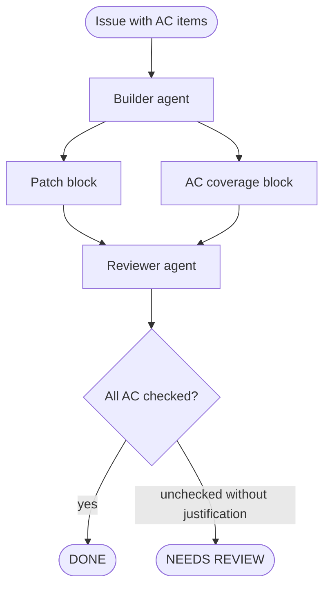

# ac-traceability

The builder agent produces a machine-scannable acceptance-criteria coverage block alongside its patch. Each AC item is either checked with a code location or explicitly excluded with a reason. The reviewer validates coverage by reading the block, not the full diff.

## How it works

1. The **builder** agent receives a list of AC items from the implementation brief.
2. For each AC item, the builder emits either:
   - `[x] <AC text> — covered by <file>:<line>`
   - `[ ] <AC text> — blocked: <reason>` (e.g. "depends on #45", "out of scope per brief")
3. The **reviewer** agent receives the patch and the AC block as separate inputs. It checks that every `[ ]` item has an explicit justification. Any unchecked item without a reason triggers `NEEDS_REVIEW`.
4. A dedicated command (`/ac-check`) can run the coverage block independently against the current branch without a full review pass.

## When to use

- Pipelines where the reviewer is a separate agent (or a human) who did not write the implementation.
- Requirements that must be auditable after merge — the AC block is committed alongside the patch.
- Teams where AC items are written before implementation starts (spec-first or BDD workflows).

## When not to use

- Exploratory tasks with no upfront AC — forcing a coverage block on open-ended work produces noise.
- Agents that cannot reliably map their output to specific file/line locations (e.g. long-running refactors that touch hundreds of locations).

## Trade-offs

| | |
|---|---|
| **Pro** | Reviewer does not need to re-read the full diff to confirm coverage |
| **Pro** | Unchecked AC with no justification is mechanically detectable — no prose judgment required |
| **Pro** | AC block doubles as an audit trail committed to the repo |
| **Con** | Builder must emit accurate file:line references — hallucinated locations are worse than no block |
| **Con** | AC items must be discrete and verifiable upfront; vague AC produces a vague block |
| **Con** | Adds a structured output contract the builder must satisfy on every call |

## Failure modes

- **Hallucinated coverage**: builder emits `[x] AC — covered by auth.ts:42` but the line doesn't exist or doesn't cover the AC.
- **Rubber-stamp block**: builder checks every item without actually verifying; reviewer trusts the block blindly.
- **AC drift**: issue AC is edited after the builder runs; the block refers to the old AC items and the reviewer cannot detect the mismatch.

## Implementation reference

`ai-dev-tools`:
- `agents/code-builder-feature.md` — Output section: AC coverage checklist format
- `agents/code-builder-bug.md` — Output section: same AC coverage format
- `agents/code-reviewer.md` — Input: receives AC block as explicit input; triggers NEEDS_REVIEW on unchecked items
- `commands/ac-check.md` — standalone command to run AC validation against current branch
