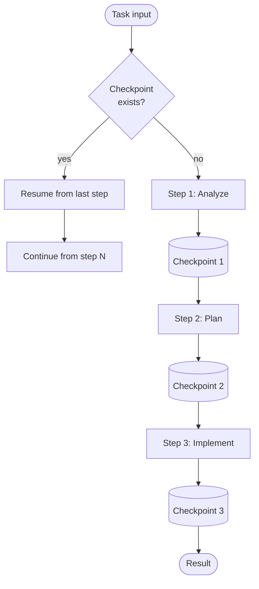

# checkpoint-resume

The pipeline persists its state after each step. On failure or restart, it resumes from the last saved checkpoint rather than restarting from scratch.

## How it works

1. Before starting, the pipeline checks for an existing **checkpoint file**.
2. If found, it skips all completed steps and resumes from the next one.
3. After each step completes, the full accumulated state is **written to disk**.
4. On successful completion, the checkpoint is cleared.

## When to use

- Pipelines with expensive intermediate steps (slow agents, API calls, file generation) where restarting from zero is wasteful.
- Long pipelines run in unstable environments (CI runners, serverless, rate-limited APIs).

## When not to use

- Short pipelines (2–3 fast steps) where restart cost is negligible.
- Tasks where intermediate state can go stale (e.g. real-time data that changes between runs).

## Trade-offs

| | |
|---|---|
| **Pro** | Crash recovery is free — restart the process and it continues |
| **Pro** | Easy to inspect intermediate state for debugging |
| **Con** | Stale checkpoints produce wrong results if the task input changes between runs |
| **Con** | Disk I/O on every step adds latency; on large state objects this matters |

## Failure modes

- **Stale checkpoint** — task input changed but the checkpoint was not cleared; the pipeline resumes from an outdated state.
- **Partial write** — process crashes mid-write; checkpoint is corrupt. Mitigate with atomic writes (write to temp file, then rename).
- **Schema drift** — a code change alters the state structure; old checkpoints are incompatible.
