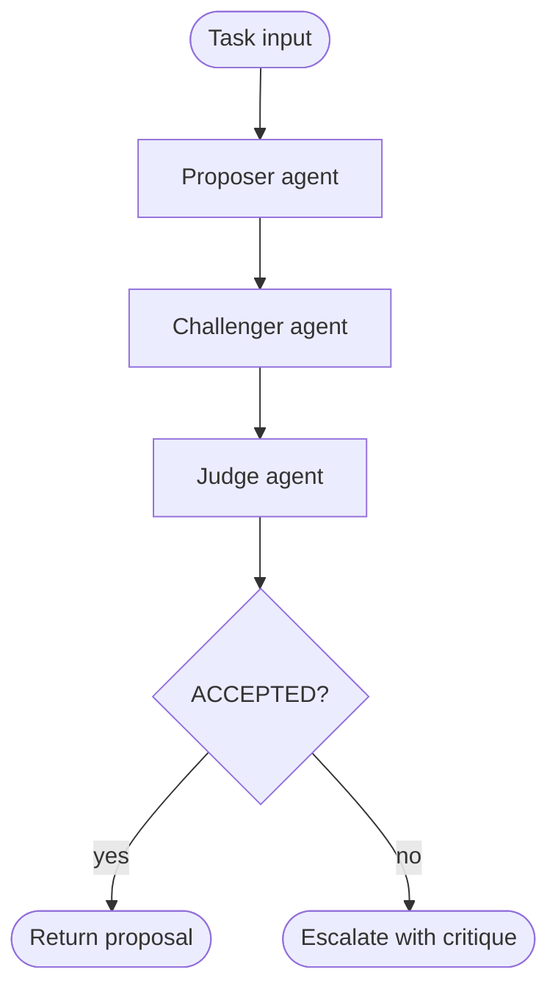

# critic-pair

Two agents play adversarial roles before a result is accepted. The proposer produces a solution; the challenger actively tries to break it. A judge makes the final call.

## How it works

1. The **proposer** agent produces an implementation for the task.
2. The **challenger** agent receives the proposal and tries to find every flaw: bugs, edge cases, security issues, performance problems.
3. The **judge** agent evaluates both and responds with `ACCEPTED` or `REJECTED`. If rejected, the critique is returned as structured feedback.

## When to use

- High-stakes outputs where a single-pass reviewer misses adversarial cases (auth logic, data parsing, financial calculations).
- Situations where you want explicit, structured critique rather than a yes/no review.

## When not to use

- Routine low-risk tasks — the overhead of three agents is rarely justified.
- When the judge's criteria are vague; judge and challenger will contradict each other without converging.

## Trade-offs

| | |
|---|---|
| **Pro** | Surfaces flaws that a non-adversarial reviewer skips |
| **Pro** | Produces a structured critique even when rejected — useful as input to a fix loop |
| **Con** | Three sequential agent calls; 3× latency and cost of a single-agent review |
| **Con** | Challenger can hallucinate flaws that don't exist, causing false rejections |

## Failure modes

- **Hallucinated critique** — challenger invents flaws; judge rejects a correct proposal.
- **Sycophantic judge** — judge always accepts to avoid conflict, defeating the adversarial purpose.
- **Infinite rejection** — combine with a `loop-with-guard` if the proposer retries on rejection, otherwise the pipeline stalls.
