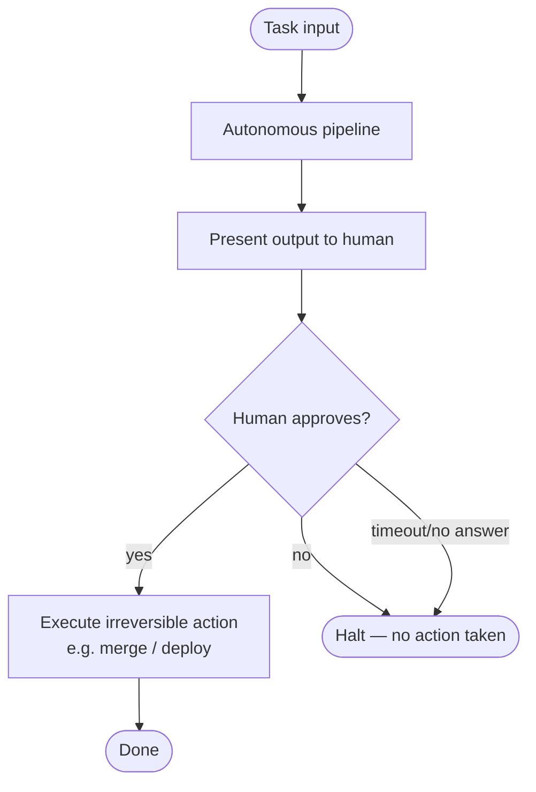

# human-gate

A human approval step is placed at the boundary between autonomous execution and irreversible action. The system stops and waits — it does not proceed on timeout.

## How it works

1. The autonomous pipeline runs to completion and produces a candidate output.
2. The candidate is presented to a human for review.
3. The human explicitly approves (`yes`) or rejects (`no`).
4. Only on explicit approval does the system execute the irreversible action (merge, deploy, send, etc.).
5. On rejection — or if no answer is given — the pipeline halts. Nothing is committed.

## When to use

- Any pipeline whose final action is irreversible: merges, deploys, emails, billing charges.
- Pipelines where autonomous quality is high but accountability must remain with a human.

## When not to use

- High-volume, low-risk tasks where human review is a bottleneck and the cost of a mistake is low.
- Fully automated CI pipelines where human latency is unacceptable and rollback is cheap.

## Trade-offs

| | |
|---|---|
| **Pro** | Hard guarantee that no irreversible action occurs without human sign-off |
| **Pro** | Simple to reason about — the gate is a single, explicit point |
| **Con** | Introduces human latency into the pipeline |
| **Con** | Can be bypassed if the "irreversible" action is not correctly identified |

## Failure modes

- **Gate bypass** — the irreversible action is split across two steps; the second step is not guarded.
- **Rubber-stamping** — humans approve without reading, defeating the purpose of the gate.
- **Timeout auto-proceed** — a poorly implemented gate proceeds on timeout; this implementation explicitly does not.
