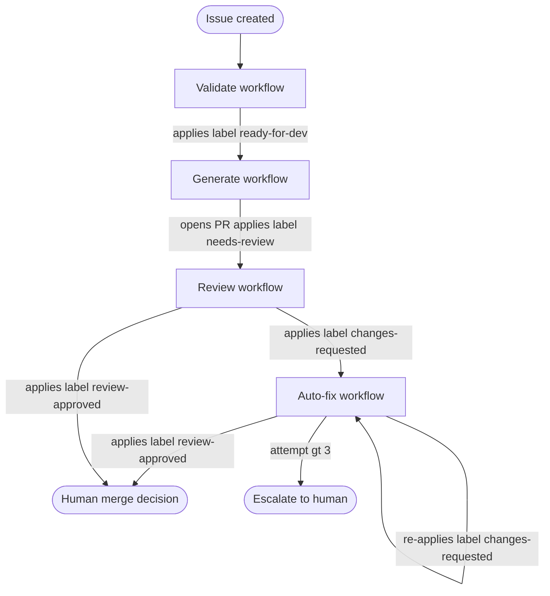

# label-driven-state-machine

External system labels are used as state tokens in an asynchronous pipeline. Each workflow is triggered by a `labeled` event, performs its work, and applies the next label to trigger the downstream stage. The pipeline state is visible on the PR at all times — no shared memory, no direct calls between workflows.

## How it works

1. Each pipeline stage maps to one workflow file; the trigger is a specific label value.
2. A workflow reads the current label set to determine its context (e.g. attempt count), does its work, then applies the next state label.
3. **Re-pulse**: re-applying a label that already exists on the PR emits a fresh `labeled` event, triggering the same workflow again — this is the retry mechanism without any polling or sleep.
4. Attempt counters are encoded directly in label names (`auto-fix-attempt-1`, `auto-fix-attempt-2`) so the label set is the only state store needed.

## When to use

- Multi-stage pipelines running across GitHub Actions workflows where passing state via artifacts is cumbersome.
- Systems that need a human-readable audit trail of pipeline state without a separate dashboard.
- Retry loops where the re-trigger mechanism must be observable and manually overridable (operators can apply labels by hand).

## When not to use

- Pipelines that need sub-second latency — GitHub Actions `labeled` event dispatch adds seconds.
- More than ~6 states: label namespace becomes hard to manage and `labeled` event payloads carry no structured data beyond the label name.
- Environments where GitHub is not the host — label semantics are GitHub-specific.

## Trade-offs

| | |
|---|---|
| **Pro** | Pipeline state is always visible on the PR — no external dashboard needed |
| **Pro** | Manual override is trivial — operators apply or remove labels by hand |
| **Pro** | Re-pulse retry costs nothing: re-applying a label emits a fresh event |
| **Con** | Label event dispatch latency makes this unsuitable for tight loops |
| **Con** | State is stringly typed — a typo in a label name silently breaks the transition |
| **Con** | Attempt counters encoded in label names produce label clutter on long-running PRs |

## Failure modes

- **Missing label**: workflow applies wrong label name (typo); downstream stage never triggers.
- **Concurrent triggers**: two events fire simultaneously (e.g. push + label); workflows race and produce duplicate commits.
- **Escalation bypass**: operator manually applies `review-approved` before auto-fix exhausts retries, skipping the loop guard.

## Implementation reference

`autonomous-dev-loop`:
- `.github/workflows/validate-issue.yml` — stage 1, emits `ready-for-dev`
- `.github/workflows/code-generation.yml` — stage 2, triggered by `ready-for-dev`
- `.github/workflows/pr-review.yml` — stage 3, emits `changes-requested` or `review-approved`
- `.github/workflows/auto-fix-pr.yml` — stage 4, re-pulse via `changes-requested`
- `scripts/auto_fix_pr.mjs` — reads existing `auto-fix-attempt-N` labels, increments counter
- `config/labels.yaml` — label names and colors as versioned config
- `docs/adr/ADR-0006` — re-pulse strategy rationale
