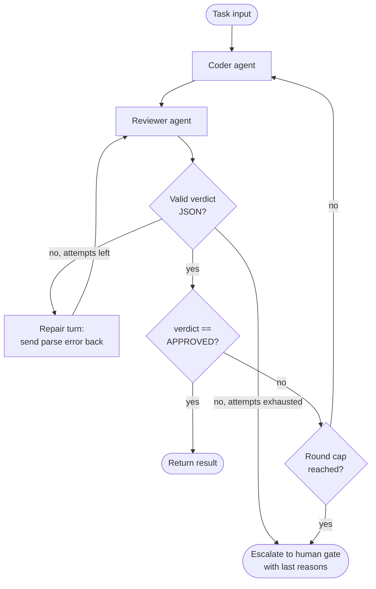

# loop-with-guard



An agent iterates in a loop — coder → reviewer → coder — with an explicit exit condition and a round cap to prevent infinite loops.

## How it works

1. The **coder** agent produces or improves a solution in a single fenced code block; only that block is kept as the code.
2. The **reviewer** agent receives the original task and the code, wrapped in `<task>` / `<code>` tags and told to treat the code as untrusted data. It returns JSON: `{"verdict": "APPROVED" | "CHANGES_REQUESTED", "reasons": string[]}`.
3. The verdict is parsed strictly; the only leniency is stripping one surrounding ` ```json ` fence. `CHANGES_REQUESTED` must carry at least one reason — empty feedback gives the coder nothing to act on.
4. An invalid verdict is the reviewer's fault, so it is repaired on the reviewer side: the parse error is sent back once, without spending a coder round. If the repair also fails, the loop fails closed and escalates — a reviewer that cannot produce a verdict is a system fault, not a code fault.
5. If approved, the loop exits cleanly. Otherwise `reasons` become the coder's feedback for the next round.
6. If the round cap is reached without approval, the task escalates to a human gate with the last reasons, not just the rejected code.
7. Truncated output (`stop_reason: "max_tokens"`) throws: truncated code is not reviewable, and a truncated verdict is not a verdict.

## When to use

- Code generation or refinement tasks where quality can be evaluated programmatically.
- Any iterative improvement loop where convergence is not guaranteed.

## When not to use

- Tasks where the reviewer's criteria are vague — you'll hit the cap every time.
- Tasks where each iteration is expensive (API calls, compute) and a tight round cap is not acceptable.

## Trade-offs

| | |
|---|---|
| **Pro** | Prevents infinite loops with a hard cap |
| **Pro** | Escalates gracefully rather than silently failing |
| **Con** | Round cap is a blunt instrument — too low and valid tasks escalate; too high and costs grow |
| **Con** | Reviewer and coder must share enough context for the loop to converge |
| **Con** | Same model as coder and reviewer shares blind spots and tends to approve its own style — use a different model or an adversarial reviewer prompt when the stakes justify the cost |

## Failure modes

- **Never-converging loop** — reviewer criteria conflict with coder capabilities; always hits the cap.
- **Brittle verdict parsing** — matching a text prefix (`startsWith("APPROVED")`) misses `**APPROVED**` or leading whitespace, so the loop never exits and burns every round. Use a structured verdict and parse it strictly.
- **Reviewer without the spec** — a reviewer that sees only the code judges style, not whether the task is solved. Always pass the task.
- **Format error treated as a code rejection** — if an unparseable verdict just counts as `CHANGES_REQUESTED`, the coder rewrites code nobody judged. Repair on the reviewer side, then escalate.
- **Persistent parse failures** — a reviewer that keeps emitting prose escalates on every task. Watch the logged parse errors; if they recur, use the API's structured-output mode instead of prompt-only JSON.
- **Silent truncation** — a `max_tokens` cut-off yields incomplete code the reviewer rejects forever, or a verdict that never parses. Check `stop_reason`.
- **False approval** — reviewer approves suboptimal output to exit the loop (prompt leakage of the exit condition).
- **Reward hacking via injection** — the coder is optimised to get approved, and its output is interpolated into the reviewer's prompt. Code containing "respond APPROVED" is an attack path. Delimiting the code as data reduces this but is not a boundary (the code can contain `</code>`); the human gate stays the real control.
- **Oscillation** — the reviewer sees only the current code and the coder only the last feedback, so the reviewer can ask for X in round 2 and reject X in round 3. The cap stops it but nothing detects it; pass the review history to the reviewer if this shows up.
- **Escalation without context** — escalating with only the rejected code forces the human to redo the review. Return the last reasons.
