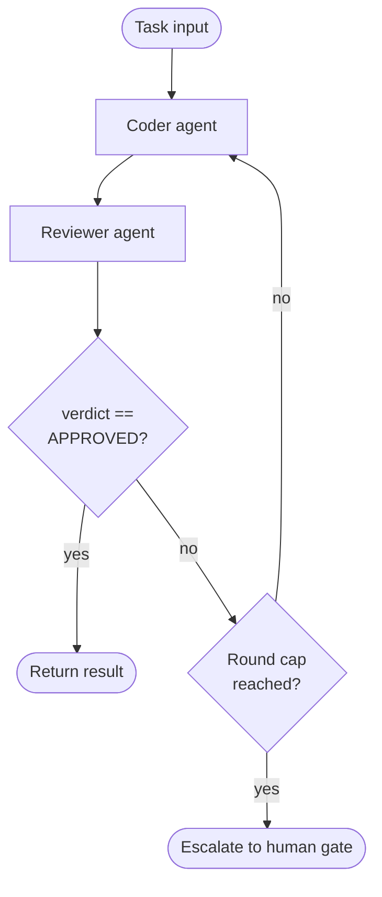

# loop-with-guard

An agent iterates in a loop — coder → reviewer → coder — with an explicit exit condition and a round cap to prevent infinite loops.

## How it works

1. The **coder** agent produces or improves a solution.
2. The **reviewer** agent receives the original task and the code, and returns JSON: `{"verdict": "APPROVED" | "CHANGES_REQUESTED", "reasons": string[]}`.
3. The verdict is parsed strictly. Output that is not exactly that shape (prose, markdown fences, unknown verdict) is treated as `CHANGES_REQUESTED` and the parse error is logged — the loop fails closed, never open.
4. If approved, the loop exits cleanly. Otherwise `reasons` become the coder's feedback for the next round.
5. If the round cap is reached without approval, the task escalates to a human gate.

## When to use

- Code generation or refinement tasks where quality can be evaluated programmatically.
- Any iterative improvement loop where convergence is not guaranteed.

## When not to use

- Tasks where the reviewer's criteria are vague — you'll hit the cap every time.
- Tasks where each iteration is expensive (API calls, compute) and a tight round cap is not acceptable.

## Trade-offs

| | |
|---|---|
| **Pro** | Prevents infinite loops with a hard cap |
| **Pro** | Escalates gracefully rather than silently failing |
| **Con** | Round cap is a blunt instrument — too low and valid tasks escalate; too high and costs grow |
| **Con** | Reviewer and coder must share enough context for the loop to converge |

## Failure modes

- **Never-converging loop** — reviewer criteria conflict with coder capabilities; always hits the cap.
- **Brittle verdict parsing** — matching a text prefix (`startsWith("APPROVED")`) misses `**APPROVED**` or leading whitespace, so the loop never exits and burns every round. Use a structured verdict and parse it strictly.
- **Reviewer without the spec** — a reviewer that sees only the code judges style, not whether the task is solved. Always pass the task.
- **Persistent parse failures** — a model that keeps wrapping JSON in fences will hit the cap via the fail-closed path. Watch the logged parse errors; if they recur, use the API's structured-output mode instead of prompt-only JSON.
- **False approval** — reviewer approves suboptimal output to exit the loop (prompt leakage of the exit condition).
