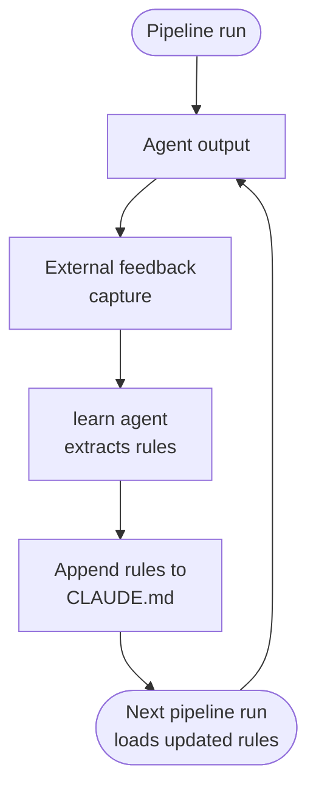

# reflexive-loop

A pipeline observes its own past outputs and modifies its instruction set persistently. Rules extracted from human feedback are encoded into `CLAUDE.md` (or equivalent prompt files) and loaded automatically on every subsequent run — no human re-intervention required.

## How it works

1. The pipeline produces an output (PR, doc, code review).
2. A human reviews and provides feedback — inline comments, corrections, explicit instructions.
3. A **learn agent** reads the session transcript and feedback, extracts discrete, actionable rules.
4. Rules are appended to `CLAUDE.md` (workspace root, repo-level, or a per-domain skill file).
5. The next pipeline run loads the enriched instruction set automatically — the agent is stricter, more aligned, without any prompt editing by the developer.

## Implementations

**[`ai-dev-tools`](https://github.com/koydas/ai-dev-tools)**
- `/learn` command reads the current session, extracts rules, and updates `CLAUDE.md`.
- Hierarchical `CLAUDE.md` (workspace root → per-repo) acts as the persistence vector.
- Learned rules become passive skills loaded automatically at session start.
- Cycle: PR review → human nit-picks → `/learn` → `CLAUDE.md` enriched → next PR has fewer nit-picks.

**[`autonomous-dev-loop`](https://github.com/koydas/autonomous-dev-loop)**
- `code-generation → pr-review → auto-fix` loop with a 3-iteration cap.
- `prompts/*.md` files loaded at runtime are the natural injection point for learned rules.
- Each `REQUEST_CHANGES → fix` cycle is a capturable feedback signal.

## When to use

- Pipelines that run repeatedly on similar tasks where the same feedback recurs across runs.
- Teams with stable review conventions that are not yet encoded in prompts.
- Any workflow where "the agent keeps making the same mistake" is the dominant complaint.

## When not to use

- One-shot or low-frequency pipelines — the learning overhead exceeds the benefit.
- Tasks where the correct behaviour changes run-to-run; persisted rules will contradict new requirements.
- Feedback that is ambiguous or context-specific; learning agents will over-generalise.

## Trade-offs

| | |
|---|---|
| **Pro** | Nit-pick rate decreases measurably across runs without prompt engineering effort |
| **Pro** | Rules are visible, versioned, and reviewable — unlike fine-tuning or vector memory |
| **Con** | Incorrect feedback produces incorrect rules; garbage in, garbage persists |
| **Con** | `CLAUDE.md` grows unbounded without a pruning strategy; contradictions accumulate |
| **Con** | Rule extraction quality depends on session transcript completeness |

## Failure modes

- **Rule proliferation** — every run appends; after N cycles the instruction file is contradictory or too long to load effectively. Mitigation: pair with a **prune agent** that periodically deduplicates and consolidates the rule set (merge semantically equivalent rules, drop superseded ones, enforce a line-count budget). This is a natural `/prune` command complement to `/learn`.
- **Feedback misinterpretation** — learn agent generalises a context-specific correction into a universal rule. Mitigation: scope rules to a section header (e.g. `## Rules — PR reviews`) so they can be audited and pruned by domain.
- **Silent regression** — a learned rule fixes issue A while breaking behaviour B; no reviewer catches it until B resurfaces. Mitigation: treat `CLAUDE.md` as a versioned file and review its diff on every `/learn` run before committing.
