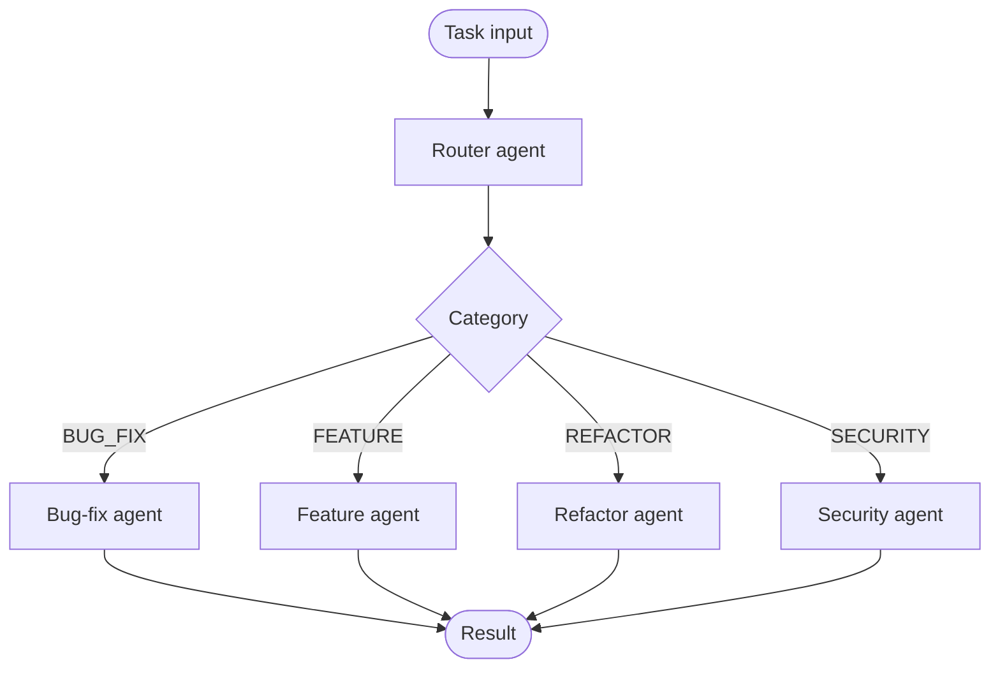

# router

A classifier agent analyzes the input and dispatches to the appropriate specialist agent. The routing decision is made once, upfront — no specialist ever sees tasks outside its domain.

## How it works

1. The **router** agent classifies the input into a known category (e.g. `BUG_FIX`, `FEATURE`, `REFACTOR`, `SECURITY`).
2. The category determines which **specialist** agent receives the task.
3. The specialist processes the task with a focused system prompt.

## When to use

- Pipelines where input type varies significantly and a single generalist agent produces worse results than a specialist.
- Systems where you want each agent's context to stay narrow and auditable.

## When not to use

- Tasks that span multiple categories at once (e.g. a bug fix that also requires a security patch) — the router will misclassify or you'll need a second pass.
- When the category set is unstable — adding new categories requires rewriting the router prompt.

## Trade-offs

| | |
|---|---|
| **Pro** | Each specialist is focused — smaller prompt, better results |
| **Pro** | Easy to add specialists without touching existing ones |
| **Con** | Misclassification silently sends the task to the wrong agent |
| **Con** | Tasks that span categories require either multi-label routing or a fallback generalist |

## Failure modes

- **Misclassification** — the router picks the wrong category; the specialist produces a confident but irrelevant result.
- **Unknown category** — input doesn't fit any known category; the router hallucinates a label or falls through to a default.
