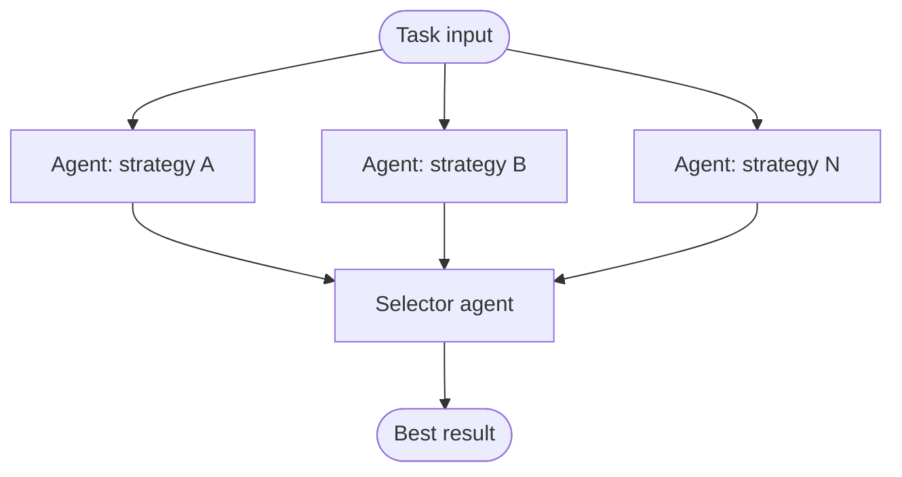

# speculative-race

Multiple agents tackle the same task in parallel with different strategies. All run to completion; a selector agent picks the best result. Losers are discarded.

## How it works

1. N **strategy agents** receive the same task and run in parallel, each with a different system prompt (e.g. minimal fix, robust fix, refactor-first fix).
2. All results are collected.
3. A **selector agent** receives all candidates and picks the best one, with a justification.

## When to use

- Tasks where the best approach is uncertain upfront (e.g. a bug with multiple plausible fixes).
- Situations where result quality matters more than cost, and strategies have high variance.

## When not to use

- Tasks with a single obvious correct solution — parallel agents produce redundant results.
- Cost-sensitive pipelines — N agents run to completion regardless of early quality signals.

## Trade-offs

| | |
|---|---|
| **Pro** | Wall-clock time is the slowest single agent, not N agents in sequence |
| **Pro** | Explores solution space without committing to a strategy upfront |
| **Con** | Cost is N × single-agent cost, always — no short-circuiting |
| **Con** | Selector quality determines outcome; a bad selector negates the diversity benefit |

## Failure modes

- **Selector bias** — selector consistently picks the longest or most verbose answer, regardless of correctness.
- **Strategy convergence** — all agents produce nearly identical outputs despite different prompts; diversity is illusory.
- **Cost explosion** — unbounded N strategies on a large task; gate N to 2–4 in practice.
