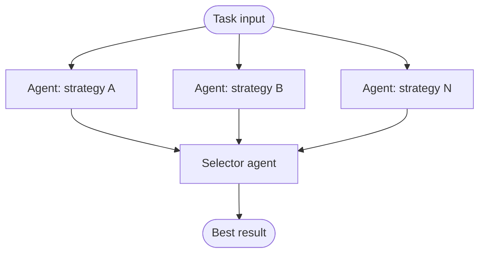

# speculative-race

```mermaid
flowchart TD
    Input([Task input]) --> A1[Agent: strategy A]
    Input --> A2[Agent: strategy B]
    Input --> A3[Agent: strategy N]
    A1 & A2 & A3 --> Selector[Selector agent]
    Selector --> Done([Best result])
```

Multiple agents tackle the same task in parallel with different strategies. Each runs until it settles (succeeds, fails, or hits its deadline); a selector agent picks the best successful result. Losers and failures are discarded.

## How it works

1. N **strategy agents** receive the same task and run in parallel, each with a different system prompt (e.g. minimal fix, robust fix, refactor-first fix).
2. Each strategy gets its own deadline (`AbortSignal.timeout`). Results are collected with `Promise.allSettled`; rejected or timed-out strategies are logged and filtered out. If some failed, the run is logged as degraded; if every strategy fails, the orchestrator throws.
3. A **selector agent** receives all candidates and picks the best one, with a justification.

Run `FAIL_STRATEGY=robust node impl.mjs` or `HANG_STRATEGY=refactor node impl.mjs` to exercise the failure and timeout paths.

## `allSettled` vs `all` vs `any`

| Combinator | Semantics | Fit |
|---|---|---|
| `Promise.all` | Waits for all, **rejects on the first failure** — surviving results are lost | Wrong here: one flaky strategy kills the whole run |
| `Promise.allSettled` | Waits for all, reports each outcome | **Run all, select best** — this pattern |
| `Promise.any` | Resolves with the **first success**; rejects with `AggregateError` only if all fail | True race: first acceptable answer wins |

Use `Promise.any` instead when candidates are interchangeable and any success is good enough — there is no quality ranking, so there is nothing for a selector to do, and latency is the goal (e.g. the same request against redundant providers, or strategies that each end in a pass/fail check such as "tests pass"). Note that `Promise.any` does not stop the losers: pass an `AbortSignal` to each strategy and abort after the winner resolves, otherwise you still pay N × cost.

## When to use

- Tasks where the best approach is uncertain upfront (e.g. a bug with multiple plausible fixes).
- Situations where result quality matters more than cost, and strategies have high variance.

## When not to use

- Tasks with a single obvious correct solution — parallel agents produce redundant results.
- Cost-sensitive pipelines — N agents run to completion regardless of early quality signals.

## Trade-offs

| | |
|---|---|
| **Pro** | Wall-clock time is the slowest single agent, not N agents in sequence |
| **Pro** | Explores solution space without committing to a strategy upfront |
| **Con** | Cost is N × single-agent cost, always — no short-circuiting |
| **Con** | Selector quality determines outcome; a bad selector negates the diversity benefit |

## Failure modes

- **Selector bias** — selector consistently picks the longest or most verbose answer, regardless of correctness.
- **Strategy convergence** — all agents produce nearly identical outputs despite different prompts; diversity is illusory.
- **One hang blocks all** — `allSettled` waits for every strategy, so without a per-strategy deadline one stuck call blocks the selector indefinitely. The signal must reach the real call (e.g. `client.messages.create(params, { signal })`), otherwise the timeout rejects but the request keeps running and billing.
- **Silent degradation** — with 1 of N candidates left, the selector has nothing to choose between. Log the degraded ratio; consider a minimum quorum if selection quality matters.
- **Cost explosion** — unbounded N strategies on a large task; gate N to 2–4 in practice.
