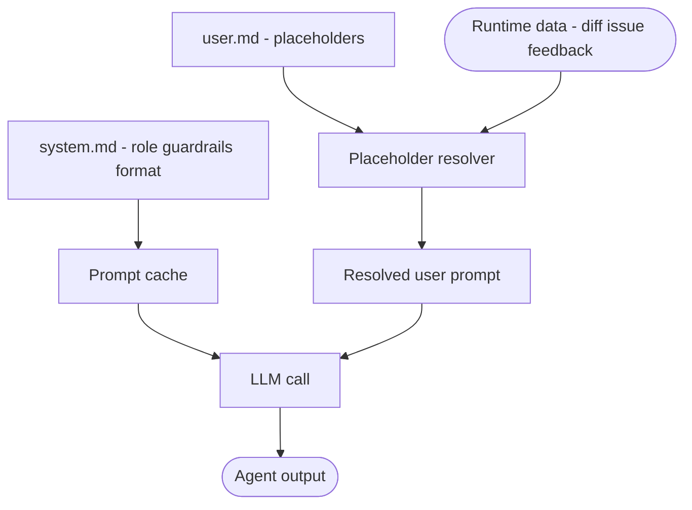

# staged-prompt-separation

Each pipeline stage stores its prompt in two files: a system file containing the invariant context (role, guardrails, output format) and a user file containing dynamic placeholders resolved at runtime. The system prompt is cached by the LLM provider; only the user prompt varies per call.

## How it works

1. The **system file** (`*-system.md`) defines what the agent is and what it must never do. It changes only when behavior changes — not on every call.
2. The **user file** (`*-user.md`) contains `{{placeholder}}` tokens resolved at runtime from the current call's data (issue body, PR diff, review feedback).
3. The system prompt is sent with `cache_control: ephemeral` (Anthropic) or equivalent. Subsequent calls with the same system prompt hit the cache — input tokens are not re-billed.
4. Changing guardrails or output format requires editing only the system file, with no code change.

## When to use

- Pipelines where the same agent is called multiple times with different inputs (retry loops, batch processing).
- Teams that want prompt engineers or operators to tune behavior without touching application code.
- Any stage calling the same provider repeatedly where system tokens represent a significant fraction of input cost.

## When not to use

- One-shot agents called once per pipeline run — caching yields no benefit.
- Prompts where the "invariant" part changes frequently (e.g. injecting dynamic context like user permissions into the system prompt defeats caching).

## Trade-offs

| | |
|---|---|
| **Pro** | System prompt cache hits eliminate re-billing of invariant tokens on repeated calls |
| **Pro** | Guardrails and output format are editable without a code deploy |
| **Pro** | System and user concerns are independently versioned and diffable |
| **Con** | Two files per stage doubles the prompt artifact count |
| **Con** | Placeholder resolution adds a runtime step; unresolved placeholders silently reach the LLM |
| **Con** | Cache invalidation is opaque — providers cache on exact token match; even whitespace changes bust the cache |

## Failure modes

- **Unresolved placeholder**: `{{issue_body}}` reaches the LLM as a literal string; output is nonsensical.
- **Cache bust from system drift**: frequent system prompt edits eliminate cost savings.
- **Role bleed**: dynamic content (user-controlled input) accidentally lands in the system prompt and overrides guardrails.

## Implementation reference

`autonomous-dev-loop`:
- `prompts/validation-system.md` + `prompts/validation-user.md`
- `prompts/generation-system.md` + `prompts/generation-user.md`
- `prompts/pr-review-system.md` + `prompts/pr-review-user.md`
- `prompts/auto-fix-system.md` + `prompts/auto-fix-user.md`
- `scripts/lib/anthropic_client.mjs` — applies `cache_control` to system messages
- `scripts/lib/prompts.mjs` — `loadPrompt`, `interpolatePrompt`
- `docs/adr/ADR-0014` — prompt caching decision and provider-specific notes
