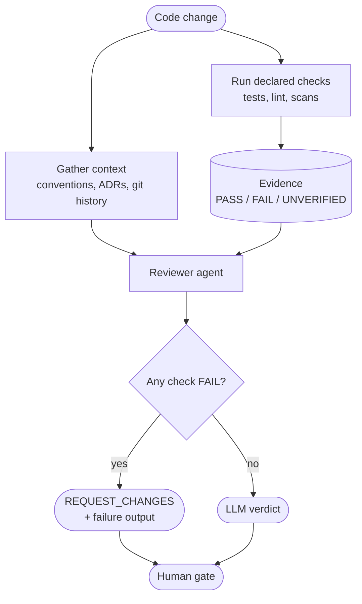

# tool-grounded-review



A reviewer agent judges a change from **executed evidence**, not from reading the diff alone. Before producing a verdict it gathers the context the diff does not show and runs the repository's own checks; a failing check blocks approval regardless of what the model concludes.

## How it works

1. **Gather context** — bounded to the touched files: governing conventions (`CLAUDE.md`, ADRs), recent git history, callers of changed symbols.
2. **Run checks** — tests, linters, type-checkers, scans. The commands are **declared** (config or repo docs), never invented by the model.
3. **Build evidence** — each check yields `PASS`, `FAIL`, or `UNVERIFIED` (timeout, spawn error, stale commit, not executed), plus the tail of its output.
4. **Review** — the evidence is injected into the reviewer's context. The model analyzes failures and may loop to confirm a hypothesis.
5. **Gate in code** — any `FAIL` forces `REQUEST_CHANGES` deterministically. `UNVERIFIED` never passes silently: it is surfaced, and the policy decides whether it blocks.
6. **Feedback** — the failure output travels verbatim with the verdict, so a fixer agent gets a concrete target instead of a paraphrase.

## Variants

| | **A — pushed evidence** | **B — tool-use loop** |
|---|---|---|
| Who chooses what to run | Code (fixed list) | The model, within a call budget |
| Cost / latency | Predictable | Variable |
| Determinism | High | Low |
| Model requirement | Any | Reliable tool calling |
| Can investigate | No — sees only what it is given | Yes — reads files, re-runs a check |
| Where tools execute | Separate step, can be isolated from secrets | Same process as the LLM client, unless proxied |

Start with **A**. Move to **B** when reviews are missing context the fixed list cannot anticipate — and keep A's evidence as B's seed context.

## When to use

- Generated code, or any pipeline where the reviewer is itself an LLM: a reviewer that cannot execute anything will approve a red test suite.
- A fix loop (`loop-with-guard`) downstream: failure output is the highest-signal feedback a fixer can get.
- Builders that produce evidence claims (`typed-evidence-chain`): the reviewer re-executes them instead of trusting them.

## When not to use

- The repo has no executable checks — there is no evidence to ground on; invest in tests first.
- The checks are slow relative to the review cadence (multi-minute suites on every push) — reuse CI results instead of re-running them.
- The review cannot be placed where executing the change is safe (see failure modes).

## Trade-offs

| | |
|---|---|
| **Pro** | A `FAIL` blocks approval independently of model quality |
| **Pro** | Failure output is concrete, verifiable feedback for a fixer |
| **Pro** | The verdict states what was and was not executed — the human gate decides with full information |
| **Con** | Review latency includes the check duration; checks often run twice (CI + review) |
| **Con** | Grounding is only as good as the declared checks — an undocumented repo gets weak evidence |
| **Con** | Executing the change is a trust boundary that must be designed, not assumed |

## Failure modes

- **Credential exposure** — the change under review executes with the reviewer's secrets in scope. Run checks in an isolated step without secrets; strip credential-like env vars from the check process.
- **Self-neutering checks** — the change modifies the check config (e.g. replaces `npm test` with `true`). Read the config from the base branch, or flag a self-modified config as non-authoritative.
- **Stale evidence** — checks ran on a different commit than the one reviewed (a push raced the run). Bind evidence to a commit SHA and treat a mismatch as unverified.
- **Silent unverified** — a missing or timed-out check is read as "nothing failed". Make `UNVERIFIED` a first-class, visible state.
- **Prompt-only gate** — the "don't approve on failure" rule lives only in the prompt and the model overrides it. Enforce it in code.
- **Infra failures burning fix attempts** — timeouts forcing `REQUEST_CHANGES` send a fixer after a problem code cannot fix. Block on `FAIL` only.

## Implementations

**[`autonomous-dev-loop`](https://github.com/koydas/autonomous-dev-loop)** — variant A ([ADR-0020](https://github.com/koydas/autonomous-dev-loop/blob/main/docs/adr/0020-tool-evidence-for-pr-review.md))
- A secret-free `evidence` job runs the checks in `config/review-evidence.yaml` on the PR head SHA and uploads the results.
- `pr_review.mjs` injects them into the review prompt, forces `REQUEST_CHANGES` on any `fail`, and appends a `🧪 Tool Evidence` section that the auto-fix stage reads as feedback.
- Missing or stale evidence and timeouts are surfaced as unverified; a PR modifying the evidence config gets non-authoritative passes.

**[`ai-dev-tools`](https://github.com/koydas/ai-dev-tools)** — closer to variant B ([ADR-009](https://github.com/koydas/ai-dev-tools/blob/main/docs/adr/ADR-009-tool-grounded-review.md))
- `pr-analyst` and `code-reviewer` run inside Claude Code: they gather context, discover check commands from the repo, run them, and re-execute builder evidence (`### Reproduction`, `### Non-regression evidence`).
- A mandatory Evidence table gates `DONE`: every row must be `PASS` or `N/A`; `NOT_RUN` halts for the human.
- Checks run only if the working tree already reflects the change — the agent never checks out or resets on its own.

## Reference implementation

[`impl.mjs`](./impl.mjs) — both variants on a local git repo:

```bash
node impl.mjs <repo-path>           # variant A: pushed evidence
node impl.mjs <repo-path> --loop    # variant B: bounded tool-use loop
```
