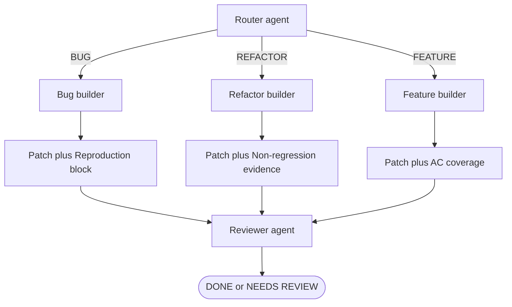

# typed-evidence-chain

Specialized builders share a common output interface but append a type-specific evidence block. The reviewer receives patch + AC + the evidence block appropriate for what it needs to validate — it never re-derives the change type or reconstructs what the builder was trying to prove.

## How it works

1. The **router** classifies the task (BUG, REFACTOR, FEATURE) and dispatches to the matching builder.
2. Each **builder** produces a patch block and an AC coverage block (shared interface), plus a type-specific evidence block:
   - `BUG` → **Reproduction block**: a test or steps that reproduce the defect *before* the fix, proving the fix is targeted.
   - `REFACTOR` → **Non-regression evidence**: confirmation that pre-existing tests pass after the change.
   - `FEATURE` → no additional block (AC coverage is sufficient).
3. The **reviewer** receives all three artifacts. Its validation strategy differs by type:
   - BUG review: does the reproduction test fail on the original code? Does the fix make it pass?
   - REFACTOR review: are there pre-existing tests? Do they still pass?
   - FEATURE review: is every AC item checked with a code location?

## When to use

- Pipelines where the same reviewer agent handles multiple change types and needs different validation signals per type.
- When review quality degrades because the reviewer must infer "what this change is supposed to prove" from prose.
- Systems that already use a `router` pattern — typed evidence is a natural extension.

## When not to use

- Single-type pipelines (e.g. only features) — the evidence type never varies, so the abstraction adds no value.
- Tasks where the change type is ambiguous or composite (e.g. a bug fix that also refactors the surrounding code) — the evidence blocks may contradict or overlap.

## Trade-offs

| | |
|---|---|
| **Pro** | Reviewer receives exactly the evidence it needs — no prompt engineering to handle all cases |
| **Pro** | Bug fixes must include a reproduction test by construction — not optional |
| **Pro** | Refactor builders cannot claim success without running existing tests |
| **Con** | Adds a per-type output contract; new change types require a new builder and a new evidence block format |
| **Con** | Misclassification by the router produces the wrong evidence block; reviewer may not catch the mismatch |
| **Con** | Reproduction blocks require the builder to reason about pre-fix behavior — harder than just writing the fix |

## Failure modes

- **Evidence fabrication**: builder emits a reproduction block that passes even on the buggy code; reviewer accepts the fabricated proof.
- **Router misclassification**: a refactor dispatched to the bug builder produces a reproduction block for a non-existent defect.
- **Evidence/patch mismatch**: the reproduction test proves a different bug than the patch actually fixes; reviewer validates evidence, not correctness.

## Implementation reference

`ai-dev-tools`:
- `agents/code-builder-bug.md` — Output: Patch + Reproduction block (mandatory)
- `agents/code-builder-refactor.md` — Output: Patch + Non-regression evidence
- `agents/code-builder-feature.md` — Output: Patch + AC coverage (no extra evidence block)
- `agents/code-reviewer.md` — Input: "type-specific evidence blocks"; validation rules differ by type
- `agents/issue-router.md` — classifies issue into type before builder dispatch
