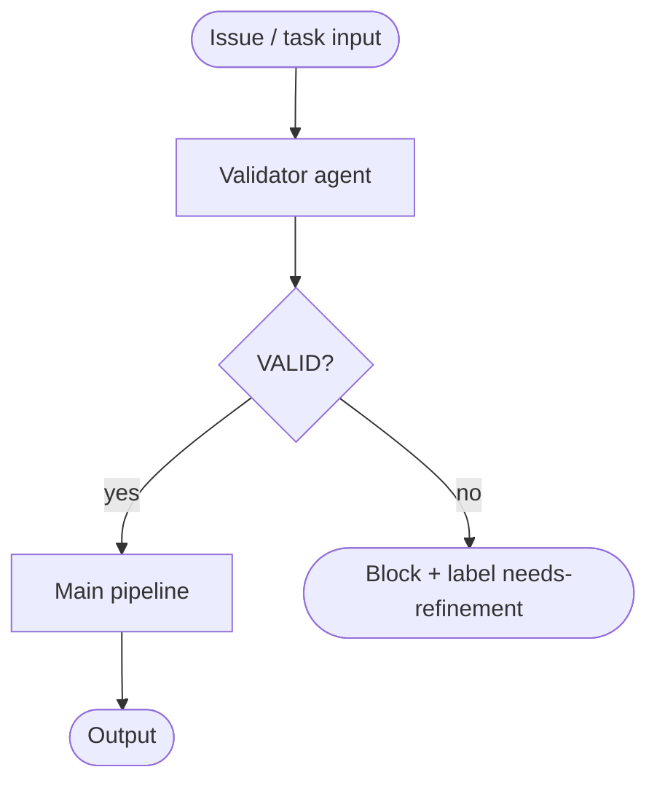

# validator-first

A validation agent runs before the main pipeline is triggered. Issues that don't pass the gate never enter the loop.

## How it works

1. The **validator** agent inspects the incoming issue or task.
2. If the issue is well-specified (`VALID`), the pipeline continues.
3. If the issue is under-specified (`NEEDS_REFINEMENT`), the pipeline is blocked and a label (e.g. `needs-refinement`) is applied — no code is generated.

## When to use

- Pipelines where under-specified input leads to wasted LLM calls or incorrect output.
- Issue-driven workflows where humans submit tasks of varying quality.

## When not to use

- Pipelines where all input is already structured and machine-generated — the validator adds latency for no gain.
- Tasks where "good enough" input is acceptable and the main agent can ask clarifying questions inline.

## Trade-offs

| | |
|---|---|
| **Pro** | Prevents wasted compute on tasks that can't succeed |
| **Pro** | Surfaces refinement needs early, before any irreversible action |
| **Con** | Adds a latency step on every request |
| **Con** | Validator criteria must be kept current as input expectations evolve |

## Failure modes

- **False negative** — validator blocks a valid issue because its criteria are too strict.
- **False positive** — validator passes a vague issue; the pipeline proceeds and produces garbage output.
