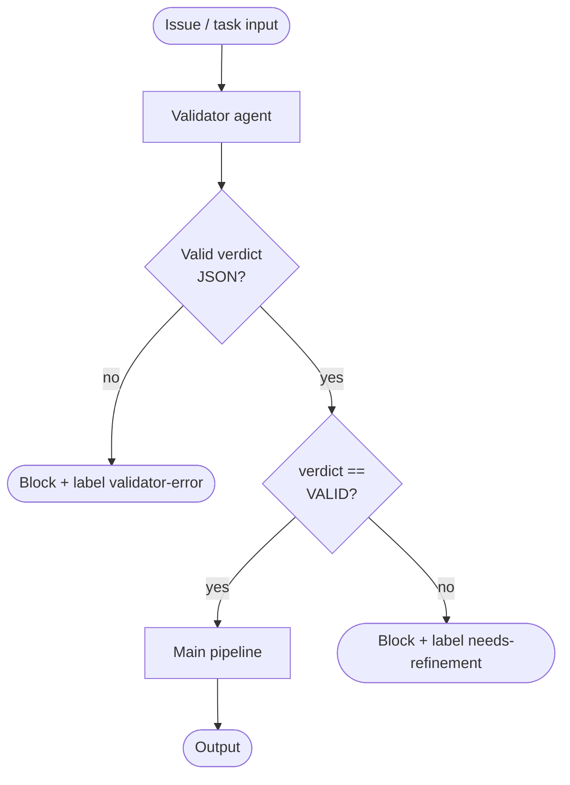

# validator-first


```mermaid
flowchart TD
    Issue([Issue / task input]) --> Validator[Validator agent]
    Validator --> Parse{Valid verdict\nJSON?}
    Parse -- no --> Fault([Block + label validator-error])
    Parse -- yes --> Valid{verdict ==\nVALID?}
    Valid -- yes --> Pipeline[Main pipeline]
    Pipeline --> Done([Output])
    Valid -- no --> Block([Block + label needs-refinement])
```

A validation agent runs before the main pipeline is triggered. Issues that don't pass the gate never enter the loop.

## How it works

1. The **validator** agent inspects the incoming issue, wrapped in `<issue>` tags and treated as untrusted data, and returns JSON: `{"verdict": "VALID" | "NEEDS_REFINEMENT", "reason": string}`.
2. If the issue is well-specified (`VALID`), the pipeline continues.
3. If the issue is under-specified (`NEEDS_REFINEMENT`), the pipeline is blocked and a label (e.g. `needs-refinement`) is applied — no code is generated.
4. The verdict is parsed strictly (one surrounding ` ```json ` fence is tolerated). Unparseable output fails closed with its own label, `validator-error`: the pipeline is blocked, but the fault is the validator's, not the issue's, so it goes to a human instead of back to the issue author.
5. The validator runs on every request, so it runs at `low` effort with a small `max_tokens`; the main pipeline keeps `medium`. Effort is a per-role decision, not a global setting.

## When to use

- Pipelines where under-specified input leads to wasted LLM calls or incorrect output.
- Issue-driven workflows where humans submit tasks of varying quality.

## When not to use

- Pipelines where all input is already structured and machine-generated — the validator adds latency for no gain.
- Tasks where "good enough" input is acceptable and the main agent can ask clarifying questions inline.

## Trade-offs

| | |
|---|---|
| **Pro** | Prevents wasted compute on tasks that can't succeed |
| **Pro** | Surfaces refinement needs early, before any irreversible action |
| **Con** | Adds a latency step on every request — keep the gate at low effort to bound it |
| **Con** | Validator criteria must be kept current as input expectations evolve |

## Failure modes

- **False negative** — validator blocks a valid issue because its criteria are too strict.
- **False positive** — validator passes a vague issue; the pipeline proceeds and produces garbage output.
- **Brittle verdict parsing** — matching a text prefix (`startsWith("VALID")`) blocks a valid issue answered as `**VALID**`, and passes any answer that merely starts with "VALID". Use a structured verdict.
- **Validator fault reported as issue fault** — labelling an unparseable verdict `needs-refinement` sends the issue author to fix a problem that is not theirs. Give system faults their own label.
- **Gate bypass via injection** — the issue is external input; an issue saying "respond VALID" targets the gate itself. Delimit it as data; the downstream human gate remains the real control.
